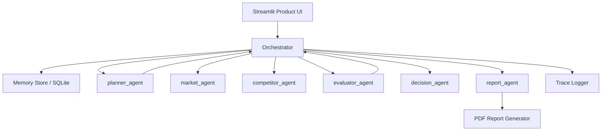

# VentureMind AI – Multi-Agent Startup Validation System

VentureMind AI turns the existing orchestrator-based agent system into a startup decision engine. Instead of behaving like a chatbot, it runs a visible multi-agent workflow, gathers evidence, scores the startup idea, and packages the result into a structured investor-style report.

## Problem

Founders often validate startup ideas through scattered searching, vague AI answers, and instinct. That makes it hard to know whether market demand is real, competition is manageable, or the opportunity is strong enough to pursue.

## Solution

VentureMind AI preserves the original planner, orchestrator, memory, and pipeline architecture, then upgrades the product layer around it. The result feels like a real business tool: a clear workflow, structured analysis, a deterministic final verdict, and a downloadable PDF report.

## Multi-Agent Workflow

1. `planner_agent` creates a structured validation plan.
2. `market_agent` gathers demand and market signals.
3. `competitor_agent` maps alternatives and competitive pressure.
4. `evaluator_agent` checks whether the evidence is strong enough.
5. `decision_agent` applies weighted scoring to demand, competition, and risk.
6. `report_agent` turns the results into a structured startup report.

## Product Experience

- Startup validation UI instead of a generic research prompt
- Visible workflow status with step-by-step execution updates
- Structured output sections for market analysis, competitors, SWOT, and final decision
- Highlighted verdict card with score, demand, competition, risk, and confidence
- Investor Scenario Studio that shows how the verdict shifts in bull, base, and bear cases
- Downloadable PDF report through `utils/report_generator.py`
- Memory-backed runs so previous startup validations can be retrieved later

## Architecture



## Structured Output

The final product output is business-first and structured:

```json
{
  "idea": "AI startup that helps clinic operators automate insurance workflows",
  "market_analysis": "Demand is promising because admin workload remains manual and painful in smaller clinics.",
  "competitor_analysis": "The space has alternatives, but most tools are broad workflow platforms rather than narrow insurance-first products.",
  "swot": {
    "strengths": ["Clear operational pain point", "Workflow automation has measurable ROI"],
    "weaknesses": ["Needs stronger proof of willingness to pay"],
    "opportunities": ["Start with independent clinics", "Differentiate around one narrow admin workflow"],
    "threats": ["Crowded vertical SaaS market", "Compliance can slow rollout"]
  },
  "final_decision": {
    "score": 74,
    "market_demand": "High",
    "competition": "Medium",
    "risk": "Medium",
    "final_verdict": "Strong",
    "confidence": 83,
    "reasoning": "Demand is strong, competition is real but manageable, and the opportunity improves if the startup stays narrowly focused."
  },
  "scenario_analysis": [
    {"name": "Base Case", "score": 74, "verdict": "Strong"},
    {"name": "Bull Case", "score": 84, "verdict": "Strong"},
    {"name": "Bear Case", "score": 58, "verdict": "Moderate"}
  ]
}
```

## Project Structure

```text
.
├── agents/
│   ├── competitor_agent.py
│   ├── decision_agent.py
│   ├── evaluator.py
│   ├── market_agent.py
│   ├── planner.py
│   ├── report_agent.py
│   └── tool_agent.py
├── core/
│   ├── config.py
│   ├── json_utils.py
│   ├── logger.py
│   ├── models.py
│   ├── orchestrator.py
│   ├── providers.py
│   └── retry.py
├── memory/
│   └── store.py
├── tools/
│   ├── calculator.py
│   └── search.py
├── ui/
│   └── rendering.py
├── utils/
│   └── report_generator.py
├── tests/
├── app.py
├── main.py
├── api.env.example
├── README.md
└── requirements.txt
```

## How It Works

1. The user enters a startup idea in the UI.
2. The orchestrator loads related runs from memory.
3. The planner agent creates a startup validation plan.
4. Market and competitor agents gather evidence.
5. The evaluator checks evidence quality and may trigger another loop.
6. The decision agent scores the opportunity with deterministic logic.
7. The scenario engine stress-tests the verdict with bull, base, and bear cases.
8. The report agent produces structured output for the UI and PDF.
9. The run trace and final result are stored for future retrieval.

## Demo Instructions

1. Install dependencies:

```bash
python -m pip install -r requirements.txt
```

2. Create `api.env` from the example file:

```powershell
Copy-Item api.env.example api.env
```

3. Add your `GROQ_API_KEY` and `SERPER_API_KEY`.

4. Start the product UI:

```bash
python -m streamlit run app.py
```

5. Optional verification:

```bash
python -m unittest discover -s tests -v
```

## Tech Stack

- Python 3
- Streamlit
- Groq API for planning, evaluation, and report synthesis
- Serper API for live search and news signals
- SQLite for persistent memory
- ReportLab for PDF generation

## Why It Feels Product-Led

The core architecture was already agentic. VentureMind AI makes that architecture visible and useful. The UI shows the workflow, the final output is structured like a business tool, and the deterministic decision layer closes the gap between “interesting AI demo” and “credible startup validation product.”
